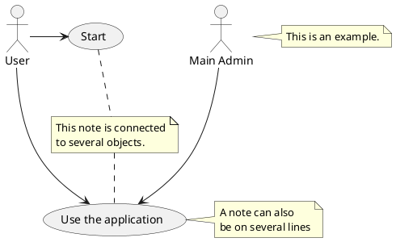

# Energy Monitor Setup
This monitoring system is current transformation (`CT`) clamp based implementation. CT technology is based on `Faraday` (Feh.ruh.dei) law (Same theory behind the generator).

## What have I used in this setup
    - CircuitSetUp
        - Open source (Crowd funded June 2019)
        - Number of communication protocols 
            i) Wifi 
            ii) 3G 
            iii) BLE
            iv) LoRa (Low powered wide area network)

        - Accuracy and the ability to measure mA level usages
            - Used one of the powerful energy metering chic is made by Microchip now Atmel

    - ESP32 As the communicator between the chip and the server

    - Home Assistant (Data storage and visualizer)
        - Open source
        - Very powerful
            - Visualization
                i) Grafana
                ii) InfluxDB

## Current Abilities
    Monitor and capture energy usage at the breaker level

## Future Enhancements
    - ML model to read the energy signature and identify individual equipments
        EX: Use cases: Home energy report will be more accurate

    - Predictive Analytics to provide equipment working condition to the customers
        Ex: 
        * Identify issues earlier and save unnecessary expensive service and replacement cost
        * Promote equipment better serve individual customer usage and matches the home energy profile (Cost efficiency of going for most energy efficient vs what best for them based on the usage)

## How does the setup looks like
    - This is how the CT installation looks like (@@ToDo::details instructions to come)

    - This is how the circuit board setup looks like  (@@ToDo::details instructions to come)

## Enclosure
    - The stl file to enclose this product is under `../3dprinting/stl-files/energy-monitor-case.stl`

